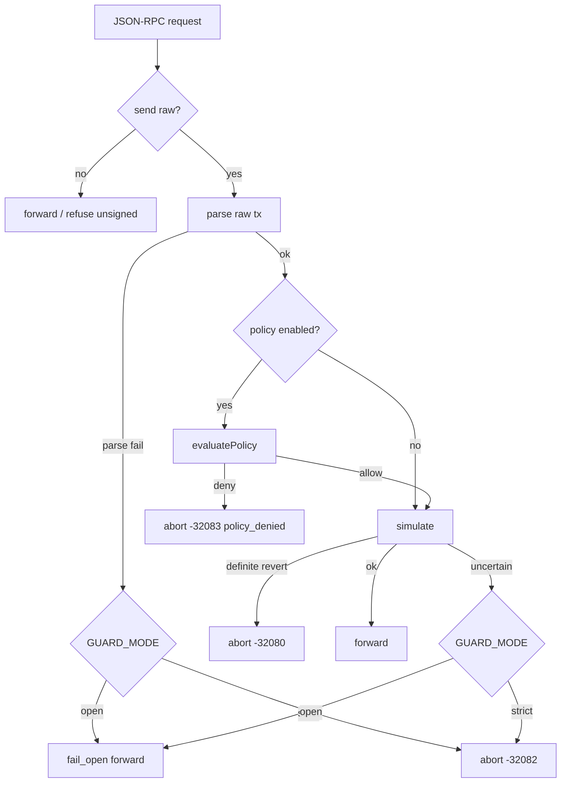

# B1 — Expert design (wallet middleware): Layer 2 + P0

**Persona:** Wallet / JSON-RPC middleware engineer  
**Inputs:** A3 P0 backlog  
**Date:** 2026-09-24

---

## 1. Goals

- Add thin address/spend policy beside Layer 1 simulation.
- Default OFF.
- Policy deny = definite STOP (`-32083`), never fail-open.
- Flow: parse → policy → sim → forward.

---

## 2. Request flow



**Why policy before sim:** denied destinations must not consume upstream sim quota or leak intent; policy is local and cheap.

---

## 3. API / types

```ts
export type GuardDecision = "abort" | "fail_open" | "forward" | "policy_denied";
export const ERR_POLICY_DENIED = -32083;

export type PolicyDenyCode =
  | "DESTINATION_NOT_ALLOWLISTED"
  | "OVER_CAP"
  | "CONTRACT_CREATE_DENIED"
  | "NEEDS_APPROVAL"
  | "POLICY_CONFIG_INVALID";

export interface SpendPolicyConfig {
  enabled: boolean;
  allowContractCreation: boolean;
  /** If true, any destination ok; still enforce caps */
  allowAnyDestination: boolean;
  globalMaxNativeWei?: bigint;
  destinations: Map<string /* lowercase */, { maxNativeWei?: bigint; requireApproval?: boolean }>;
  humanGate?: { mode: "stop"; notifyUrl?: string };
}

export interface PolicyCheckInput {
  chainId: number;
  to?: `0x${string}`;
  value: bigint;
  data?: `0x${string}`;
}

export interface PolicyCheckResult {
  allow: boolean;
  code?: PolicyDenyCode;
  reason?: string;
  effectiveTo?: `0x${string}`;
  effectiveValue?: bigint; // native or decoded ERC20 amount when applicable
}
```

---

## 4. Config schema

**File** `L2SG_POLICY_FILE` (JSON):

```json
{
  "enabled": true,
  "allowContractCreation": false,
  "allowAnyDestination": false,
  "globalMaxNativeWei": "100000000000000000",
  "destinations": {
    "0x1111111111111111111111111111111111111111": {
      "maxNativeWei": "50000000000000000"
    },
    "0x2222222222222222222222222222222222222222": {
      "requireApproval": true
    }
  },
  "humanGate": {
    "mode": "stop",
    "notifyUrl": "https://hooks.example/l2sg-policy"
  },
  "erc20TransferDecode": true
}
```

**Env:**

| Env | Meaning |
| --- | --- |
| `L2SG_POLICY_ENABLED` | true/false (default false) |
| `L2SG_POLICY_FILE` | path to JSON |
| `L2SG_POLICY_ALLOWLIST` | comma-separated addresses |
| `L2SG_POLICY_GLOBAL_MAX_WEI` | wei string |
| `L2SG_POLICY_ALLOW_CREATE` | true → allow contract creation |
| `L2SG_POLICY_ALLOW_ANY` | true → skip allowlist (caps still apply) |
| `L2SG_POLICY_NOTIFY_URL` | optional webhook |

Load rules: policy active iff `enabled` true from file or env. Merge: file base, env overrides. Startup error if enabled && !allowAny && destinations empty.

---

## 5. Policy evaluation (pseudocode)

```
if !enabled → allow
if !to → allow iff allowContractCreation else DENY CONTRACT_CREATE
normalize to
if requireApproval on dest → DENY NEEDS_APPROVAL (+ notify)
if !allowAny && !destinations.has(to) → DENY DESTINATION_NOT_ALLOWLISTED (+ notify)
valueToCheck = native value
if erc20TransferDecode && data matches transfer/transferFrom →
  recipient, amount = decode; effectiveTo = recipient; re-check allowlist on recipient;
  valueToCheck for cap = amount (token units — see B1 caveat) OR only enforce native in B1
enforce globalMax and per-dest max on native value (B1: native-only caps; ERC20 recipient allowlist only)
allow
```

**B1 caveat:** ERC20 amount caps are ambiguous without decimals — B1 enforces **allowlist on ERC20 recipient** + **native value caps only**. Refine in B2.

---

## 6. Error response

```json
{
  "jsonrpc": "2.0",
  "id": 1,
  "error": {
    "code": -32083,
    "message": "L2 Send Guard: policy_denied — destination not allowlisted",
    "data": {
      "l2SendGuard": true,
      "decision": "policy_denied",
      "layer": 2,
      "policyCode": "DESTINATION_NOT_ALLOWLISTED",
      "certainty": "definite",
      "confidence": "unknown",
      "chainId": 421614,
      "to": "0x...",
      "value": "0x0",
      "aborted": true,
      "failOpen": false,
      "hint": "Add destination to policy allowlist or disable Layer 2. Operator keeps keys."
    }
  }
}
```

---

## 7. Defaults

| Setting | Default |
| --- | --- |
| Policy enabled | **false** |
| allowContractCreation | false |
| allowAnyDestination | false |
| erc20TransferDecode | true when policy on |
| humanGate.mode | stop |
| GUARD_MODE | unchanged (open) |

---

## 8. Module layout

```
src/policy/types.ts
src/policy/load.ts      # env + JSON
src/policy/evaluate.ts  # pure check
src/policy/erc20.ts     # transfer decode helpers
src/policy/notify.ts    # fire-and-forget webhook
```

Wire into `GuardConfig.policy?: SpendPolicyConfig`, `handler.ts`, `api.ts` exports.

---

## 9. Tests plan

1. Policy disabled → existing fail-open/abort unchanged; simulate called.  
2. Enabled + allowlisted + under cap → simulate then forward.  
3. Enabled + unknown dest → `-32083`, simulate **not** called, forward not called.  
4. Enabled + over global cap → `-32083`.  
5. Enabled + over per-dest cap → `-32083`.  
6. Contract create denied.  
7. `requireApproval` → NEEDS_APPROVAL.  
8. `GUARD_MODE=strict` + policy allow + uncertain sim → still `-32082`.  
9. `GUARD_MODE=open` + policy deny → still `-32083` (not fail_open).  
10. Empty allowlist + enabled → loadConfig throws.  
11. ERC20 transfer to non-allowlisted recipient → deny even if token contract allowlisted (if decode on).

---

## 10. Known B1 weaknesses (for B2)

- ERC20 amount caps unclear  
- Multi-chain policy file not partitioned  
- Parse failures currently go straight to sim uncertain path — should policy see parse?  
- Custody creep risk if notify webhook waits  
- `allowAnyDestination` footgun under-documented
